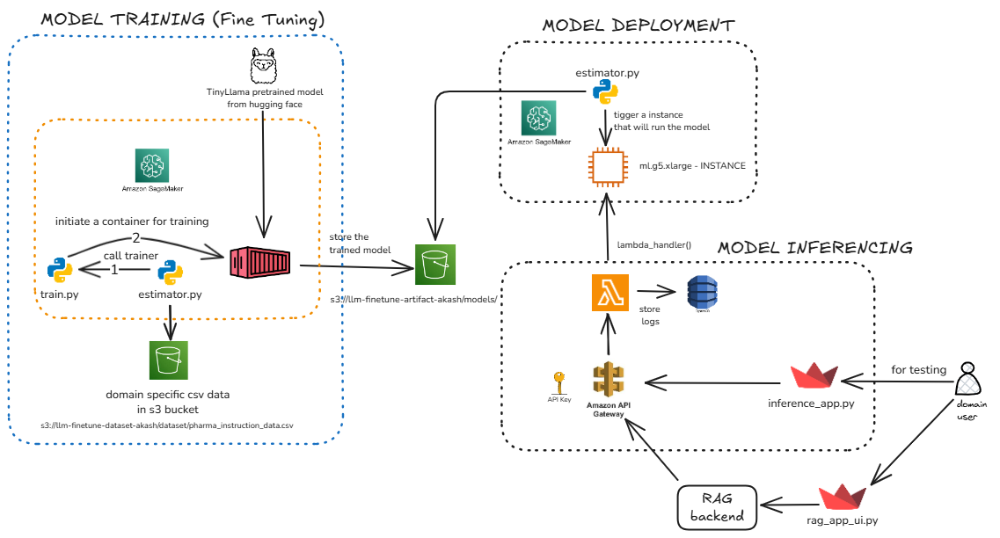

# Fine-Tuning LLM on AWS SageMaker

This project demonstrates end-to-end fine-tuning of an open-source language model (TinyLlama) on custom pharmaceutical data using AWS SageMaker, with deployment and inference capabilities through API Gateway and Lambda functions.

## Architecture



## Project Overview

This project fine-tunes a pre-trained TinyLlama model on domain-specific pharmaceutical data and deploys it as a production-ready inference service on AWS infrastructure.

### Key Features

- **Model Fine-tuning**: Fine-tune open-source LLM on custom pharma dataset using AWS SageMaker
- **Serverless Inference**: Lambda-based inference with API Gateway integration
- **Logging & Monitoring**: DynamoDB logging for inference requests and responses
- **Interactive UI**: Streamlit-based web interface for direct model interaction
- **RAG System**: Retrieval-Augmented Generation for context-aware responses

## Workflow

1. **Data Storage**: Training data stored in AWS S3 bucket
2. **Model Training**: Fine-tuning on SageMaker training instance
3. **Model Storage**: Trained model artifacts saved to S3 bucket
4. **Deployment**: Model deployed on SageMaker endpoint (ml.g5.xlarge)
5. **Lambda Integration**: AWS Lambda function for inference requests
6. **Logging**: Inference logs stored in DynamoDB
7. **API Gateway**: RESTful API for external access
8. **User Interface**: Streamlit apps for interaction

## Project Structure

```
├── architecture/
│   └── architecture.png          # System architecture diagram
├── inference/
│   └── inference.py              # SageMaker inference script
├── deployment_of_model.ipynb     # Model deployment notebook
├── inference_app_ui.py           # Direct inference Streamlit UI
├── rag_app_ui.py                 # RAG-based Streamlit UI
├── rag_app_backend.py            # RAG backend logic
└── README.md
```

## Prerequisites

- AWS Account with appropriate permissions
- AWS SageMaker access
- Python 3.10+
- Required AWS services: S3, SageMaker, Lambda, API Gateway, DynamoDB

## Setup & Installation

### 1. Install Dependencies

```bash
pip install sagemaker==2.213.0
pip install boto3 protobuf==3.20.3 requests
pip install streamlit
pip install transformers torch
```

### 2. Configure AWS Credentials

```bash
aws configure
```

### 3. Prepare Training Data

Upload your pharmaceutical training data to an S3 bucket.

## Usage

### Model Deployment

Run the deployment notebook to deploy the fine-tuned model:

```bash
jupyter notebook deployment_of_model.ipynb
```

The model will be deployed to a SageMaker endpoint named `live-finetune-my-endpoint`.

### Direct Inference UI

Launch the Streamlit app for direct model interaction:

```bash
streamlit run inference_app_ui.py
```

### RAG-Based Inference UI

Launch the RAG-enabled Streamlit app:

```bash
streamlit run rag_app_ui.py
```

The RAG system retrieves relevant context before generating responses for improved accuracy.

## AWS Components

### SageMaker
- **Training Instance**: Used for fine-tuning the model
- **Inference Instance**: ml.g5.xlarge for model deployment
- **Endpoint**: `live-finetune-my-endpoint`

### S3 Buckets
- Training data storage (`s3://llm-finetune-dataset-akash/dataset/`)
- Model artifacts storage (`s3://llm-model-artifacts-akash/model/`)

### Lambda Function
- Handles inference requests from API Gateway
- Invokes SageMaker endpoint
- Logs requests/responses to DynamoDB

### API Gateway
- RESTful API endpoint for external access
- Routes requests to Lambda function

### DynamoDB
- Stores inference logs
- Tracks request/response history

## Model Details

- **Base Model**: TinyLlama
- **Framework**: HuggingFace Transformers 4.37.0
- **PyTorch Version**: 2.1.0
- **Domain**: Pharmaceutical/Medical

## Example Query

```python
predictor.predict({
    "inputs": "what Clinical trials have shown that adding Ezetimibe to statin therapy?"
})
```

## License

This project is for educational and research purposes.

## Acknowledgments

- AWS SageMaker for training infrastructure
- HuggingFace for model and transformers library
- TinyLlama open-source model
